# Overview
In this write-up I'm going to show you how you can get a working Kaggle 
competition that could be hosted in a classroom setting. For more information
on how the file system works in this repository, take a look at the
[README](README.md). This guide breaks a few major components: getting the data
(optional; already provided in [data](/data) folder if you don't want to run
the code) and setting the necessary parts of a Kaggle competition.

# Getting the Data (optional)
For this Kaggle competition we're going to be using the Iris data set that is 
provided natively in the Scikit-learn package. If you want to see what the
data looks like, run the code provided in the 
[notebook](kaggle-competition-data-benchmark.ipynb) up to the "Running the
Benchmark" section of the notebook. 

# Starting the Kaggle Competition
To run your own in-class competition there are a number of steps that have to 
be taken. None of them are difficult, but you have to go through them for 
Kaggle to consider it a "valid" competition.

## Defining the First Competition
The first thing that you will have to do is go to Kaggle's home "competition"
website. This can be found at 
[competitions](https://www.kaggle.com/competitions). To start your own 
competition you will need to either sign into an existing Kaggle account
or make your own. I will proceed with this guide under the assumption that 
you do not have a Kaggle account.

### Making a Kaggle Account
To make a Kaggle account, click the "Sign In" link at the top right of the
image 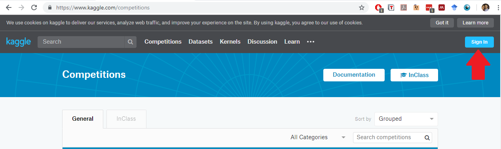. 

After clicking the link you should see
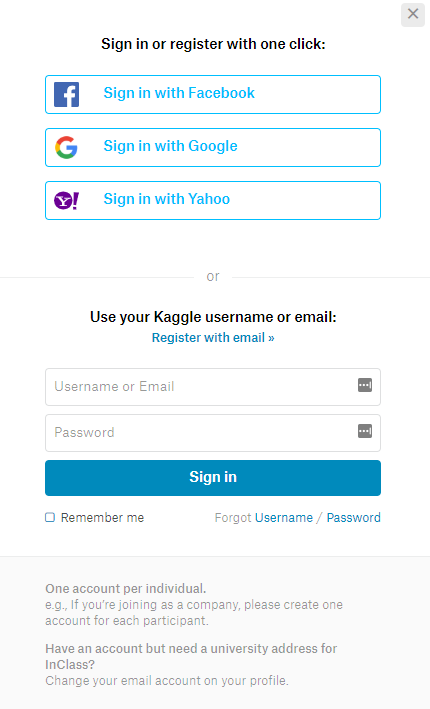. 

You can select any way that you
would like to register an account with Kaggle. Follow the instructions that
Kaggle provides.

After you have signed into your account, click the link "InClass" link:
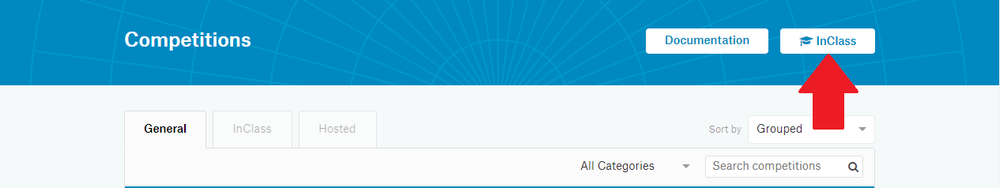. 

This will take you a new page
with the URL: <https://www.kaggle.com/about/inclass/overview>. To create the
competition, click the button, "Create new competition" as shown in the
picture 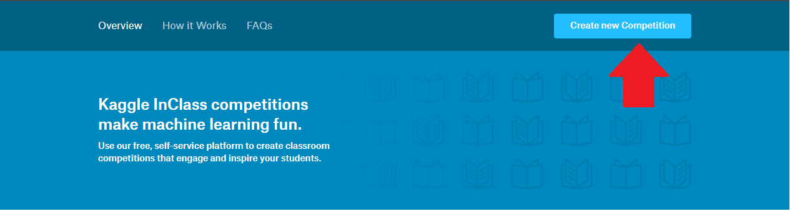.

After clicking this link, it should take you to the link 
<https://www.kaggle.com/competitions/new>. On this page we will need to do a 
few things:
1. Enter a title at the point where it asks us to type this
2. Provide a brief description of the competition
3. Create a competition URL

The descriptive title will be "Example Kaggle Competition." The brief 
description will be: "Example Kaggle competition", and the competition URL
will be "example-competition." **Make sure you click those blocks.** I made that
mistake when I made my first competition and I kept getting an error I didn't
understand. After you have provide all of those links click the "Create Competition"
button. The locations to click are shown in the figure below 
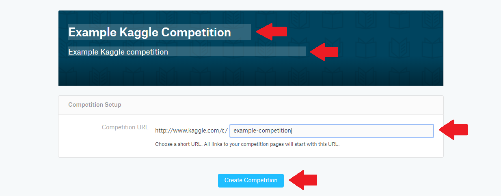. 

Once you have done all of those steps, you should now be at a page with a URL
<https://www.kaggle.com/c/example-competition>. It can be a bit overwhelming
all the things that have to be done to make the competition work, but we're
going to break it into bite-sized pieces so that we understand everything we
need to do.

First, click on the "Host" tab and in the "Host" tab, click "Launch Checklist."
It should look like 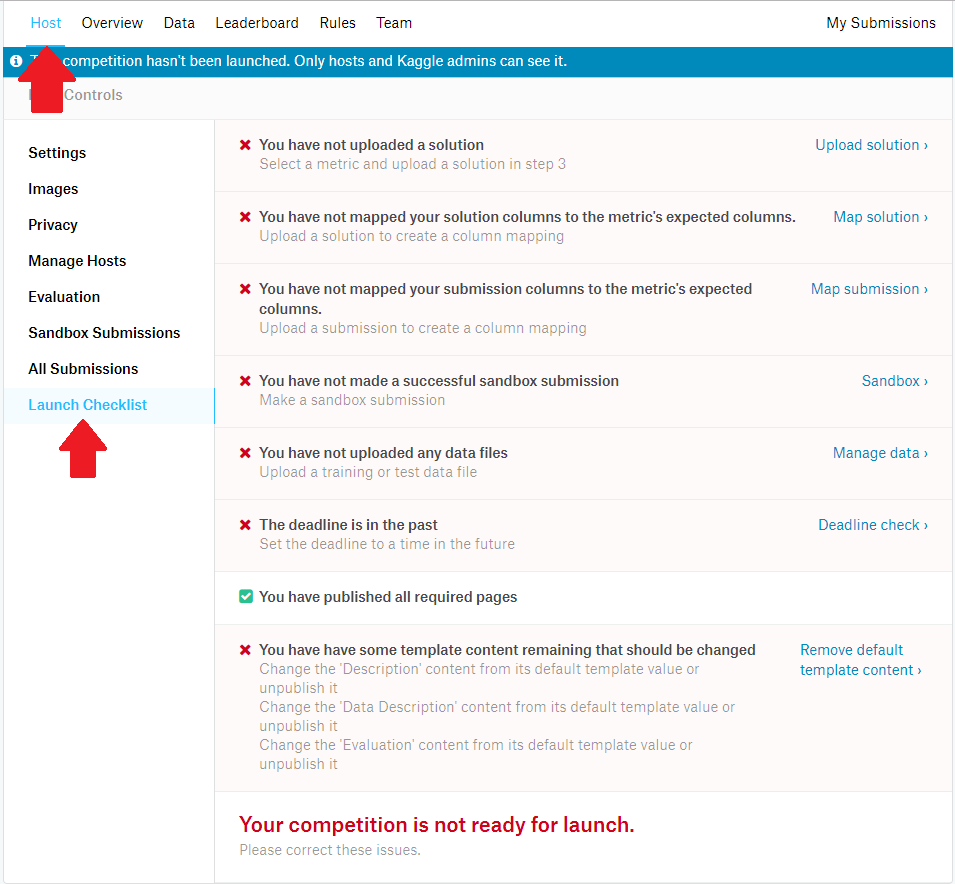.

The best approach to get this competition running is to just follow each step
of the checklist. Therefore, the firs thing we're going to do is upload a 
solution.

## Uploading the Solution
To upload the solution click "Upload solution link in the checklist"
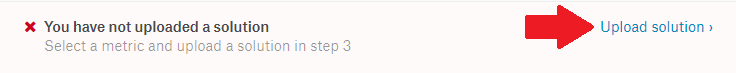.

After clicking that link, you will be taken to the URL 
<https://www.kaggle.com/c/example-competition/host#evaluation>. For this 
component of the competition, we need to select a scoring metric, we need
to provide the solution file, and we need to give an example of a valid
submission. For the scoring metric, select "CategorizationAccuracy." This 
can be found my clicking the drop-down in the "Scoring Metric" box. After
taking this action, your page should look like this
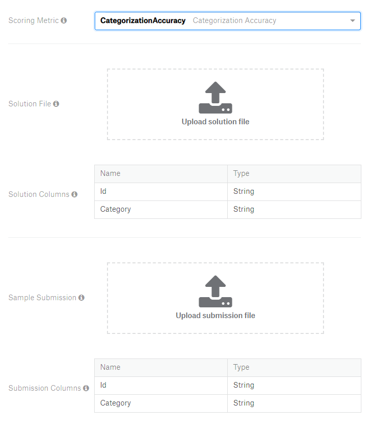. 

Next we need to upload the solution file. This can be found in the file 
`data/solution_file.csv` in the [data](/data) folder which
is provided with the repository. To upload the file click "Upload solution
file" and provide a link to the solution file. If this was done correctly, you
should see 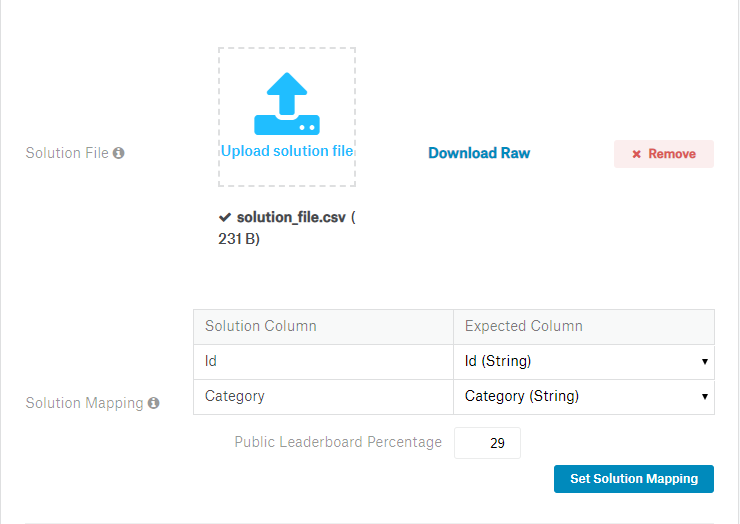.

Once the solution file has been loaded, you need to click
"Set Solution Mapping." Basically what this does is map the submission to the
expected column format. Once this has been you should see
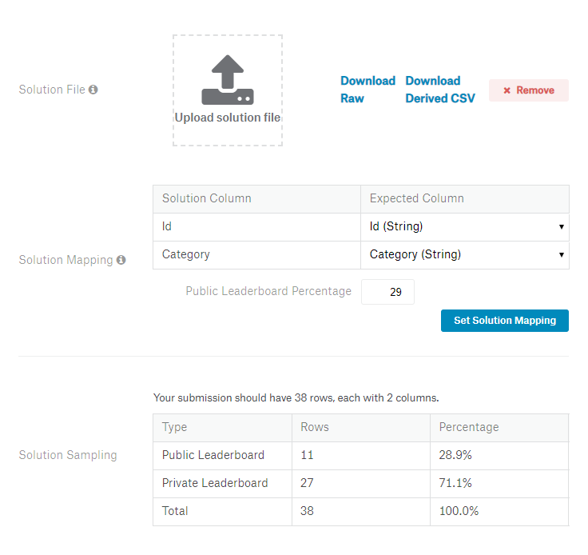.

Finally, we need to provide a valid sample submission. This has been provided
with the file `data/valid_submission.csv`. Again click the
"Upload submission file" to provide the valid submission. We also need to 
click the "Set Submission Mapping". This time though we need to provide
information for the "Validator". What is Kaggle is doing is validating the
data that has been provided in the submission and ensures that it can be 
mapped to the expected format. For the "Id" column click click:
Non-negative Integers {0, 1, ..., 100000} since we have 38 samples in the 
test set, and for the "Category" select Integers between 0 and 20 since we have
three labels in the data. After you have set those categories, remember to click
the "Set Submission Mapping" button. If this is done correctly it should look
like 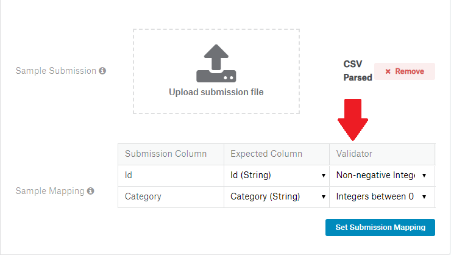

To check that everything work correctly for this part of the process let's 
return to the "Launch Checklist."

If the steps above were followed correctly, after clicking to the 
"Launch Checklist", you should see 
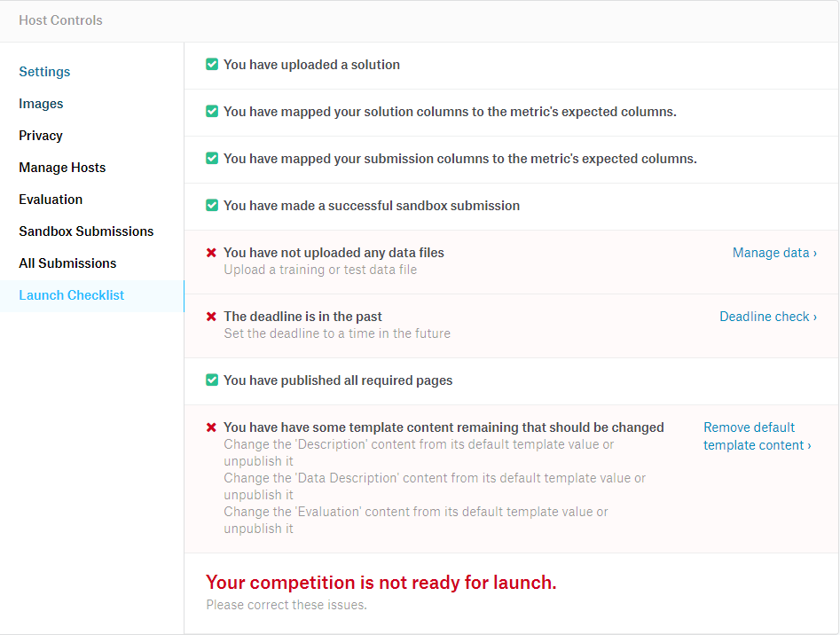. 

The next step is to upload data files. This can be done by clicking the 
"Manage data" link 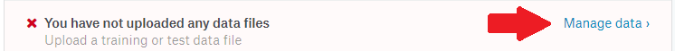.

## Manage Data
After clicking the link you should be at the URL 
<https://www.kaggle.com/c/example-competition/data>. To upload the first
version of the data files, click the button "Upload first version"
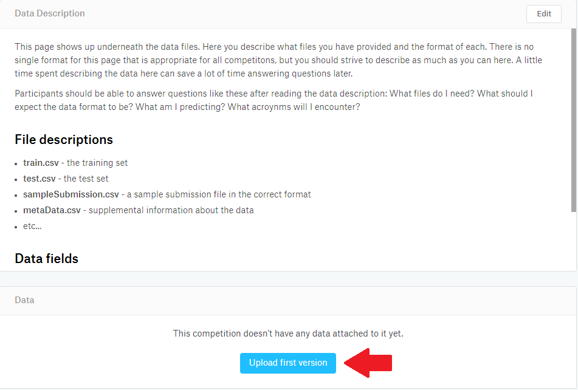. For this part, we're going to
upload the following files:

1. `data/X_train.csv`
2. `data/X_test.csv`
3. `data/y_train.csv`
4. `data/submission_file.csv`

You should not load the test labels because that defeats the point of the 
competition. The reason that we're uploading the `submission_file.csv` is 
because we want the user to understand what a valid submission looks like. To
upload these files select them from the [data](/data) folder and click the
link "Select Files to Upload." After doing so, you will have to provide 
"Version notes." For this instance, just type: "First version." After taking
these steps it should look like 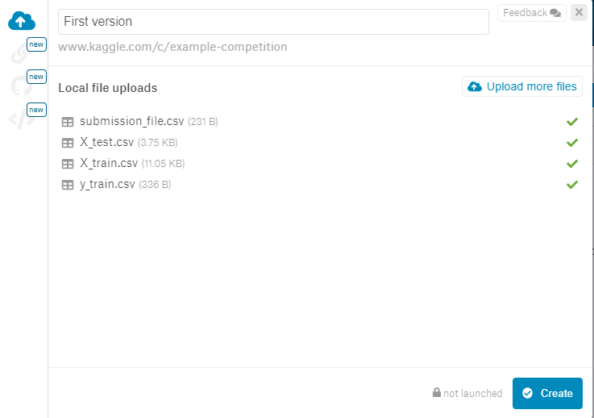.

One quick note, Kaggle, as I discovered expects the uploaded .csv files to
have headers otherwise it will treat the first row of data as the header. There
might be a way to adjust this setting, but it's probably easier to just provide
a header.

Let's again return to the Launch Checklist to see what's left to getting this
competition up and running.

After uploading the data file, the Launch Checklist should now look like
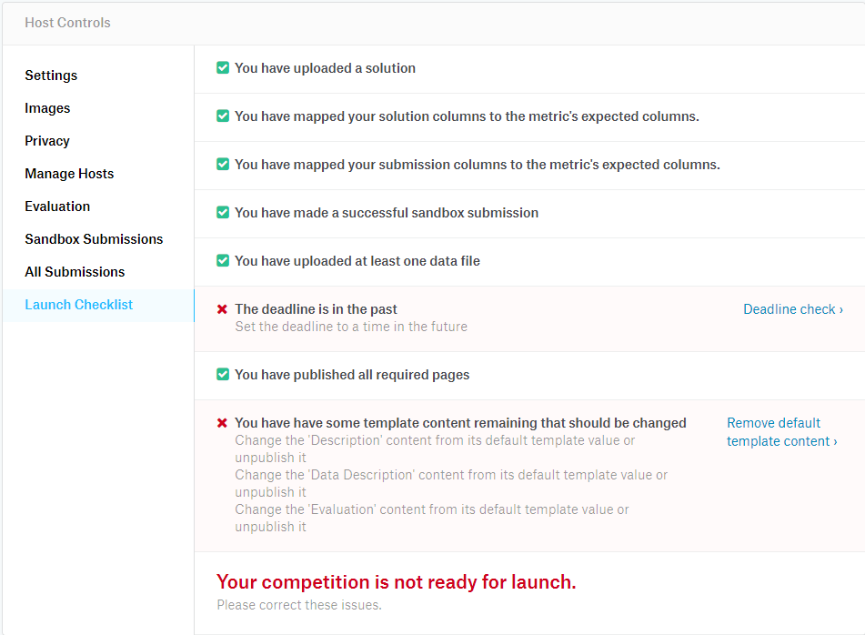.

The next thing we need to do is update the competition deadline.

## Competition Deadline
To update the competition deadline, click the "Deadline check" link. After
clicking the link you should see the URL: 
<https://www.kaggle.com/c/example-competition/host>. There are many things
that could be changed on this page, but the primary thing we have to change
is the "Deadline." Since this guide was written on 2019-02-24, I am going 
to set the deadline to 2019-03-02. When doing a competition in a real situation
though you should take of course account for how long you want it to go. After
adjust the date you should see 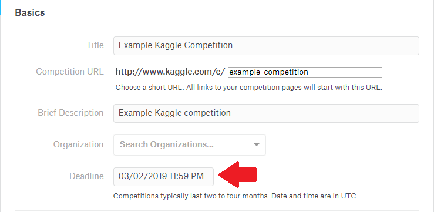.

Make sure to click "Save changes," and let's go back to the Launch Checklist.

After adjusting the date, you should now see 
. 

All that is left to do is provide information in "Description",
"Data Description", and "Evaluation" tabs. The purpose of these tabs is to
give the users an idea of what the competition entails (i.e., motivation, 
interesting problems they might see, etc.), the format of the data and what
things they should use for the competition, and how their submissions will
be evaluated, respectively. These items are very dependent upon the particular
competition, so I won't provide do anything on this front. It's something that
has to be done for each competition. However, to ensure that we can have a 
valid competition, we're just going to remove the templates. just click "Remove default template content."
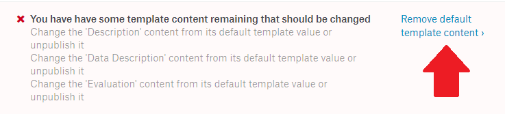.

### Description
After clicking the link you should be at the URL 
<https://www.kaggle.com/c/example-competition/overview>. In the top right, 
click "Edit," remove all the writing in the box, and type "Example description."
Once this is done, click "Save". It should look like
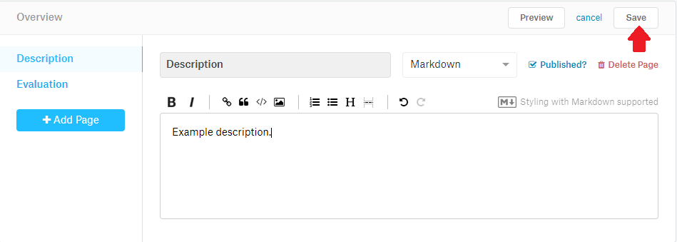.

### Evaluation
Next we need to adjust the evaluation template. Click on the "Evaluation" link
in the left tab, and again click "Edit" in the top right. Once again we're going
to delete all the writing and just write: "Example evaluation." After this is
done, click "Save." It should look like 
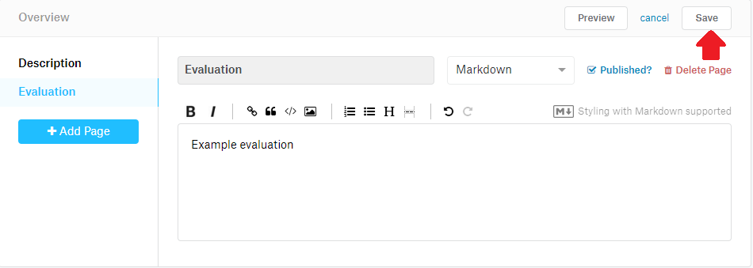.

### Data Description
Finally we need to provide a data description. To do this, click the "Data"
tab near the top 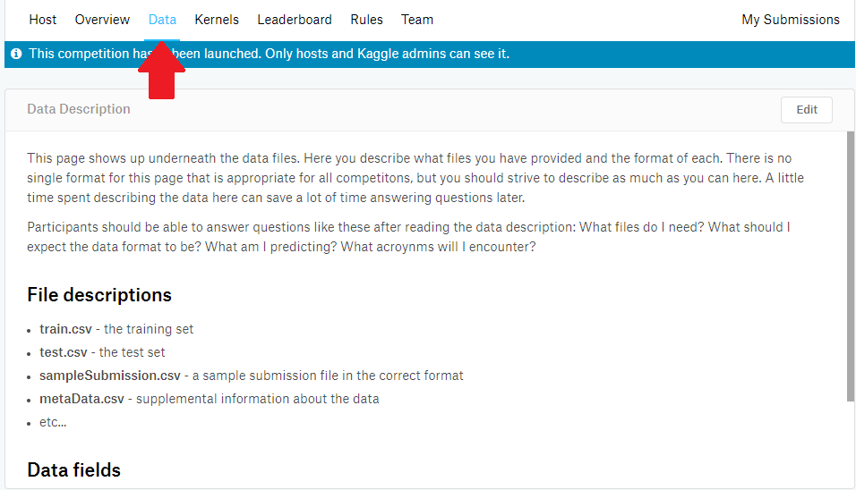.

Again we need to edit the template following the same process. Click "Edit",
remove the existing text, write "Example data description", and then save.

After taking those three actions, return back to the Launch Checklist by 
clicking Host and then Launch Checklist. If all the actions have been followed,
the checklist should now look like
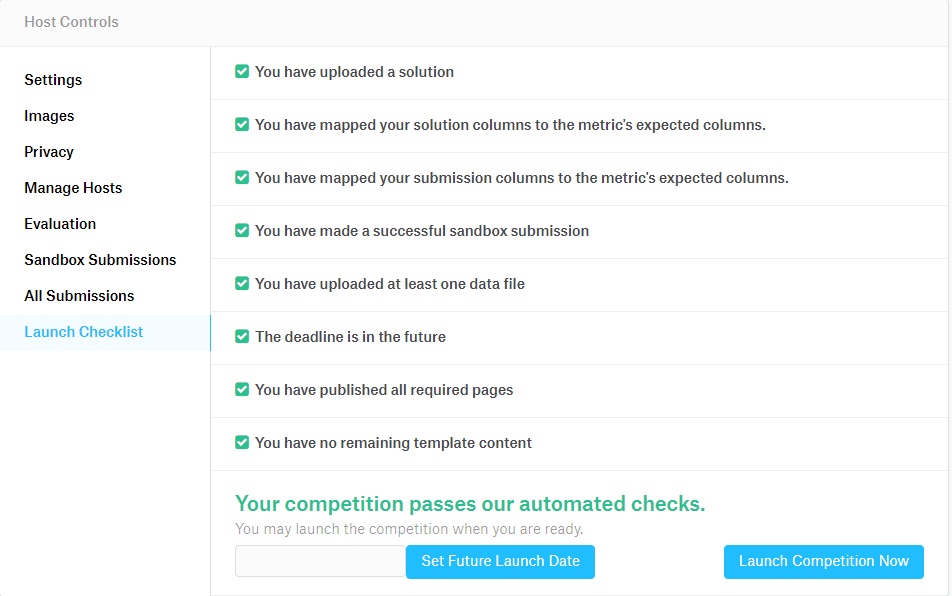.

# Conclusion
**Congratulations!** You have now successfully taken all the steps needed to 
launch your own Kaggle competition. Of course there are a number other actions
that can make the competition even better. These options include

1. Privacy -- you can set whether the competition is public or private

2. Images -- you can add pictures that make the competition page more 
interesting

3. Settings -- we only set the date, but you can also play with the number 
of submissions, whether people can team up, and other things.

In general you'll just have to play around with the page to get the full scope
of actions that you can take, but after following these directions you have 
successfully set up a working Kaggle competition.
